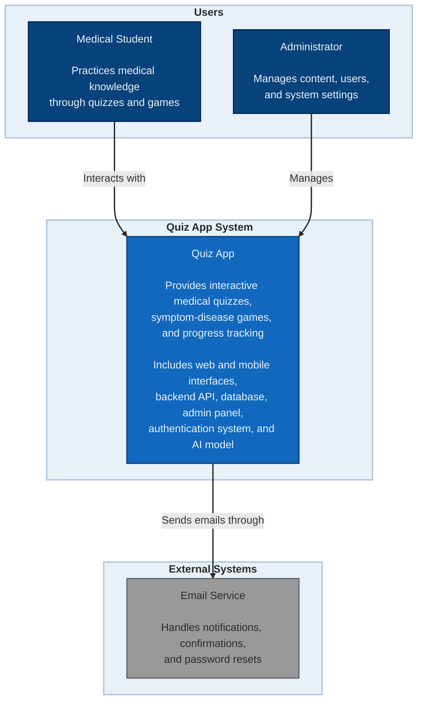

```mermaid
flowchart TB
    classDef person fill:#08427B,color:#E8F1F8,stroke:#052E56,stroke-width:2px
    classDef system fill:#1168BD,color:#E8F1F8,stroke:#0B4884,stroke-width:2px
    classDef external fill:#999999,color:#2A2A2A,stroke:#6B6B6B,stroke-width:2px

    subgraph SG_USERS ["<b>Users</b>"]
        direction TB
        MS[Medical Student<br><br>Practices medical knowledge<br>through quizzes and games]:::person
        AD[Administrator<br><br>Manages content, users,<br>and system settings]:::person
    end

    subgraph SG_MAIN ["<b>Quiz App System</b>"]
        QA[Quiz App<br><br>Provides interactive medical quizzes,<br>symptom-disease games, and progress tracking<br><br>Includes web and mobile interfaces,<br>backend API, database, admin panel,<br>authentication system, and AI model]:::system
    end

    subgraph SG_EXT ["<b>External Systems</b>"]
        ES[Email Service<br><br>Handles notifications, confirmations,<br>and password resets]:::external
    end

    MS --->|Interacts with| QA
    AD --->|Manages| QA
    QA --->|Sends emails through| ES

    style SG_USERS fill:#E8F1F8,stroke:#B0C4DE,stroke-width:2px,color:#2A2A2A
    style SG_MAIN fill:#E8F1F8,stroke:#B0C4DE,stroke-width:2px,color:#2A2A2A
    style SG_EXT fill:#E8F1F8,stroke:#B0C4DE,stroke-width:2px,color:#2A2A2A

    linkStyle default stroke:#2A2A2A,stroke-width:2px
```
