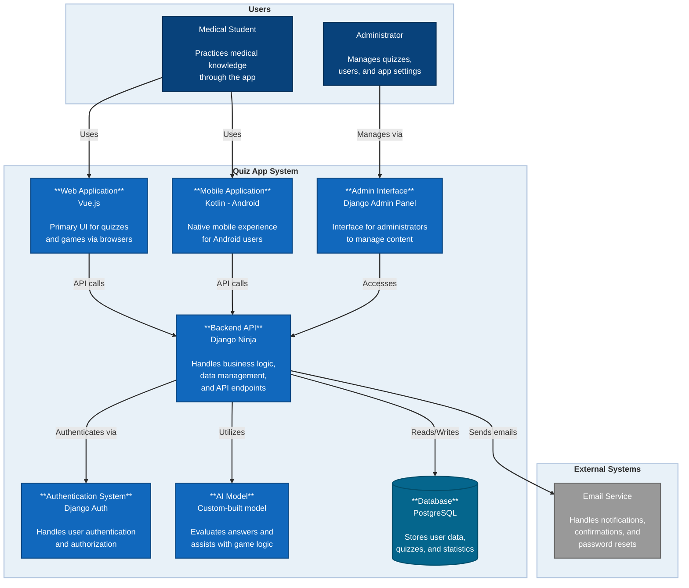

```mermaid
flowchart TB
    %% Define styles
    classDef person fill:#08427B,color:#fff,stroke:#052E56,stroke-width:2px
    classDef container fill:#1168BD,color:#fff,stroke:#0B4884,stroke-width:2px
    classDef database fill:#05668D,color:#fff,stroke:#024E6B,stroke-width:2px
    classDef external fill:#999999,color:#fff,stroke:#6B6B6B,stroke-width:2px

    %% Users
    subgraph SG_USERS ["<b>Users</b>"]
        direction TB
        MS[Medical Student<br><br>Practices medical knowledge<br>through the app]:::person
        AD[Administrator<br><br>Manages quizzes,<br>users, and app settings]:::person
    end

    %% Quiz App System
    subgraph SG_QUIZ ["<b>Quiz App System</b>"]
        direction TB
        WA[**Web Application**<br>Vue.js<br><br>Primary UI for quizzes<br>and games via browsers]:::container
        MA[**Mobile Application**<br>Kotlin - Android<br><br>Native mobile experience<br>for Android users]:::container
        API[**Backend API**<br>Django Ninja<br><br>Handles business logic,<br>data management,<br>and API endpoints]:::container
        ADM[**Admin Interface**<br>Django Admin Panel<br><br>Interface for administrators<br>to manage content]:::container
        AUTH[**Authentication System**<br>Django Auth<br><br>Handles user authentication<br>and authorization]:::container
        AIM[**AI Model**<br>Custom-built model<br><br>Evaluates answers and<br>assists with game logic]:::container
        DB[(**Database**<br>PostgreSQL<br><br>Stores user data,<br>quizzes, and statistics)]:::database
    end

    %% External Systems
    subgraph SG_EXT ["<b>External Systems</b>"]
        ES[Email Service<br><br>Handles notifications,<br>confirmations, and<br>password resets]:::external
    end

    %% Relationships
    MS ---> |Uses| WA
    MS ---> |Uses| MA
    AD ---> |Manages via| ADM
    WA ---> |API calls| API
    MA ---> |API calls| API
    ADM ---> |Accesses| API
    API ---> |Reads/Writes| DB
    API ---> |Authenticates via| AUTH
    API ---> |Utilizes| AIM
    API ---> |Sends emails| ES

    %% Styles
    style SG_USERS fill:#E8F1F8,stroke:#B0C4DE,stroke-width:2px,color:#2A2A2A
    style SG_QUIZ fill:#E8F1F8,stroke:#B0C4DE,stroke-width:2px,color:#2A2A2A
    style SG_EXT fill:#E8F1F8,stroke:#B0C4DE,stroke-width:2px,color:#2A2A2A

    %% Link style
    linkStyle default stroke:#2A2A2A,stroke-width:2px
```
